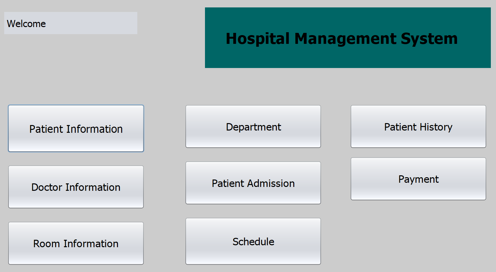

# Hospital Management System

A comprehensive Java-based system for managing hospital operations including patient records, doctor schedules, room management and billing.

## Features

- **Patient Management**: Register patients, view and update patient information
- **Doctor Management**: Manage doctor profiles, specializations, and schedules
- **Department Management**: Organize hospital departments and staff
- **Room Management**: Track room availability, types, and costs
- **Admission Management**: Handle patient admissions and room assignments
- **Payment System**: Process and track patient payments
- **Scheduling**: Manage doctor availability and appointments
- **Patient History**: Maintain medical records and treatment history

## Technologies Used

- Java Swing for the user interface
- MySQL database for data storage
- JDBC for database connectivity
- JCalendar for date handling

## Setup Instructions

1. **Database Setup**:
   - Install MySQL Server
   - Import the database schema from `utilities/hospital.sql`
   - Default database name: `hospital`

2. **Application Setup**:
   - Ensure Java JDK 8 or higher is installed
   - Configure database connection in `AllConnection.java` if needed
     - Default: localhost:3306, user: root, no password
   - Run the application from `MainMenu.java`

## Dependencies

- MySQL Connector J (included in `libs/`)
- JCalendar 1.4 (included in `libs/`)

## Screenshots

The main dashboard provides access to all system modules:

